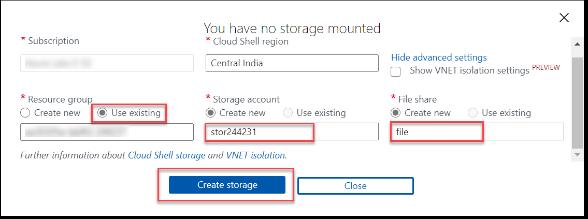
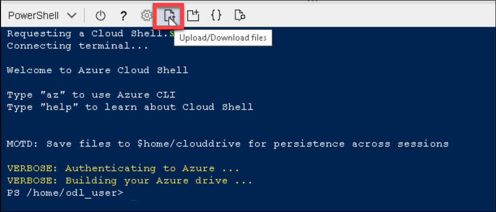

# Lab: Managing Azure Role-Based Access Control
# Student lab manual

## Lab scenario

With Azure Active Directory (Azure AD) becoming integral part of its identity management environment, the Adatum Enterprise Architecture team must also determine the optimal authorization approach. In the context of controlling access to Azure resources, such approach must involve the use of Azure Role-Based Access Control (RBAC). Azure RBAC is an authorization system built on Azure Resource Manager that provides fine-grained access management of Azure resources.

The key concept of Azure RBAC is role assignment. A role assignment consists of three elements: security principal, role definition, and scope. A security principal is an object that represents a user, group, service principal, or managed identity that is requesting access to Azure resources. A role definition is a collection of the operations that the role assignments will grant, such as read, write, or delete. Roles can be generic or resource specific. Azure includes four built-in generic roles (Owner, Contributor, Reader, and User Access Administrator) and a fairly large number of built-in resource-specific roles (such as, for example, Virtual Machine Contributor, which includes permissions to create and manage Azure virtual machines). It is also possible to define custom roles. A scope is the set of resources that the access applies to. A scope can be set at multiple levels: management group, subscription, resource group, or resource. Scopes are structured in a parent-child relationship.

The Adatum Enterprise Architecture team wants to test delegation of Azure management by using custom Role-Based Access Control roles. To start its evaluation, the team intends to create a custom role that provides restricted access to Azure virtual machines. 
  

## Objectives
  
After completing this lab, you will be able to:

-  Define a custom RBAC role 

-  Assign a custom RBAC role


Estimated Time: 60 minutes


## Lab Files

-  C:\AllFiles\AZ-303-Microsoft-Azure-Architect-Technologies-master\Allfiles\Labs\10\azuredeploy30310suba.json

-  C:\AllFiles\AZ-303-Microsoft-Azure-Architect-Technologies-master\AllFiles\Labs\10\azuredeploy30310rga.json

-  C:\AllFiles\AZ-303-Microsoft-Azure-Architect-Technologies-master\AllFiles\Labs\10\azuredeploy30310rga.parameters.json

-  C:\AllFiles\AZ-303-Microsoft-Azure-Architect-Technologies-master\AllFiles\Labs\10\roledefinition30310.json


## Instructions

### Exercise 0: Prepare the lab environment

The main tasks for this exercise are as follows:

1. Deploy an Azure VM by using an Azure Resource Manager template

1. Create an Azure Active Directory user

#### Task 1: Deploy an Azure VM by using an Azure Resource Manager template

1.From your lab computer, start a web browser, navigate to the [Azure portal](https://portal.azure.com), and sign in using the azure credentials provided in the Environment Details tab.

1. In the Azure portal, open **Cloud Shell** pane by selecting on the toolbar icon directly to the right of the search textbox.

1. If prompted to select either **Bash** or **PowerShell**, select **PowerShell**. 

1. If this is the first time you are starting **Cloud Shell** and you are presented with the **You have no storage mounted** message, select the subscription you are using in this lab and **click on Show advanced settings**.

    

1. Select existing Resource Group as **az30310a-labRG** and enter unique names for **storage account name** and **File Share** and select **Create storage**.

    

1. In the toolbar of the Cloud Shell pane, select the **Upload/Download files** icon, in the drop-down menu select **Upload**, and upload the file **C:\AllFiles\AZ-303-Microsoft-Azure-Architect-Technologies-master\Allfiles\Labs\10\azuredeploy30310rga.json** into the Cloud Shell home directory.

   

1. From the Cloud Shell pane, upload the Azure Resource Manager parameter file **C:\AllFiles\AZ-303-Microsoft-Azure-Architect-Technologies-master\Allfiles\Labs\10\azuredeploy30310rga.parameters.json**.

1. From the Cloud Shell pane, run the following to deploy a Azure VM running Windows Server 2019 that you will be using in this lab:

   ```powershell
   New-AzResourceGroupDeployment `
     -Name az30310rgaDeployment `
     -ResourceGroupName 'az30310a-labRG' `
     -TemplateFile $HOME/azuredeploy30310rga.json `
     -TemplateParameterFile $HOME/azuredeploy30310rga.parameters.json `
     -AsJob
   ```

    > **Note**: Do not wait for the deployment to complete but instead proceed to the next task. The deployment should take less than 5 minutes.


#### Task 2: Create an Azure Active Directory user

1. In the Azure portal, from the PowerShell session in the Cloud Shell pane, run the following to authenticate to the Azure AD tenant associated with your Azure subscription:

   ```powershell
   Connect-AzureAD
   ```
   
2. From the Cloud Shell pane, run the following to identify the Azure AD DNS domain name:

   ```powershell
   $domainName = ((Get-AzureAdTenantDetail).VerifiedDomains)[0].Name
   ```

3. From the Cloud Shell pane, run the following to create a new Azure AD user:

4. Make sure you replace the value of Deployment-Id and record the user principal name of the newly created Azure AD user. You will need it later in this lab.

   ```powershell
   $passwordProfile = New-Object -TypeName Microsoft.Open.AzureAD.Model.PasswordProfile
   $passwordProfile.Password = 'Pa55w.rd1234'
   $passwordProfile.ForceChangePasswordNextLogin = $false
   New-AzureADUser -AccountEnabled $true -DisplayName 'aduserDeployment-id' -PasswordProfile $passwordProfile -MailNickName 'aduserDeployment-id' -UserPrincipalName "aduserDeployment-id@$domainName"
   ```

5. From the Cloud Shell pane, run the following to identify the user principal name of the newly created Azure AD user:

   ```powershell
   (Get-AzureADUser -Filter "MailNickName eq 'aduser(Deployment-id)'").UserPrincipalName
   ```

     > Note: Make sure you replace the value of Deployment-id and record the user principal name of the newly created Azure AD user. You will need it later in this lab.

 6. Close the Cloud Shell pane.


### Exercise 1: Define a custom RBAC role
  
The main tasks for this exercise are as follows:

1. Identify actions to delegate via RBAC

1. Create a custom RBAC role in an Azure AD tenant


#### Task 1: Identify actions to delegate via RBAC

1. In the Azure portal, navigate to the **az30310a-labRG** blade.

1. On the **az30310a-labRG** blade, select **Access Control (IAM)**.

1. On the **az30310a-labRG - Access Control (IAM)** blade, select **Roles(Classic)**.

1. On the **Roles(Classic)** blade, select **Owner**.

1. On the **Owner** blade, select **Permissions**.

1. On the **Permissions (preview)** blade, select **Microsoft Compute**.

1. On the **Microsoft Compute** blade, select **Virtual machines**.

1. On the **Virtual Machines** blade, review the list of management actions that can be delegated through RBAC. Note that they include the **Deallocate Virtual Machine** and **Start Virtual Machine** actions.


#### Task 2: Create a custom RBAC role in an Azure AD tenant

1. On the lab computer, open the file **C:\AllFiles\AZ-303-Microsoft-Azure-Architect-Technologies-master\Allfiles\Labs\10\roledefinition30310.json** and review its content, Please note when trying to open the file it will show **Windows cannot open the file** then please click on **try an app on this PC** and select notepad.

   ```json
   {
      "Name": "Virtual Machine Operator (Custom)",
      "Id": null,
      "IsCustom": true,
      "Description": "Allows to start/restart Azure VMs",
      "Actions": [
          "Microsoft.Compute/*/read",
          "Microsoft.Compute/virtualMachines/restart/action",
          "Microsoft.Compute/virtualMachines/start/action"
      ],
      "NotActions": [
      ],
      "AssignableScopes": [
          "/subscriptions/SUBSCRIPTION_ID"
      ]
   }
   ```

1. On the lab computer, in the browser window displaying the Azure portal, start a **PowerShell** session within the **Cloud Shell**. 

1. From the Cloud Shell pane, upload the Azure Resource Manager template **C:\AllFiles\AZ-303-Microsoft-Azure-Architect-Technologies-master\Allfiles\Labs\10\roledefinition30310.json** into the home directory.

1. From the Cloud Shell pane, run the following command 

   ```powershell
   $subscription_id = (Get-AzContext).Subscription.id
   (Get-Content -Path $HOME/roledefinition30310.json) -Replace 'SUBSCRIPTION_ID', "$subscription_id" | Set-Content -Path $HOME/roledefinition30310.json
   ```

1. From the Cloud Shell pane, run the following to verify that the `SUBSCRIPTION_ID` placeholder was replaced with the ID value of the Azure subscription:

   ```powershell
   Get-Content -Path $HOME/roledefinition30310.json
   ```

1. From the Cloud Shell pane, run the following to create the custom role definition:

   ```powershell
   New-AzRoleDefinition -InputFile $HOME/roledefinition30310.json
   ```

1. From the Cloud Shell pane, run the following to verify that the role was created successfully:

   ```powershell
   Get-AzRoleDefinition -Name 'Virtual Machine Operator (Custom)'
   ```

8. Close the Cloud Shell pane.


### Exercise 2: Assign and test a custom RBAC role
  
The main tasks for this exercise are as follows:

1. Create an RBAC role assignment

1. Test the RBAC role assignment


#### Task 1: Create an RBAC role assignment
 
1. In the Azure portal, navigate to the **az30310a-labRG** blade.

1. On the **az30310a-labRG** blade, select **Access Control (IAM)**.

1. On the **az30310a-labRG - Access Control (IAM)** blade, select **+ Add** and select the **Add role assignment** option.

1. On the **Add role assignment** blade, specify the following settings (leave others with their existing values) and select **Save**:
> Note: replace the Deployment-id with your deployment id given in environment detail page and record the user principal name of the newly created Azure AD user. You will need it later in this lab.

    | Setting | Value |
    | --- | --- |
    | Role | **Virtual Machine Operator (Custom)** |
    | Assign access to | **Azure AD user, group, or service principal** |
    | Select | **aduser(Deployment-id)** |


#### Task 2: Test the RBAC role assignment

1. From the lab computer, start a new in-private web browser session, navigate to the [Azure portal](https://portal.azure.com), and sign in by using the **aduserDeployment-id** user account with the **Pa55w.rd1234** password.

    > Note: Make sure to use the user principal name of the **aduser(Deployment-id)** user account, which you recorded earlier in this lab.

1. In the Azure portal, navigate to the **Resource groups** blade. Note that you are not able to see any resource groups. 

1. In the Azure portal, navigate to the **All resources** blade. Note that you are able to see only the **az30310a-vm0** and its managed disk.

1. In the Azure portal, navigate to the **az30310a-vm0** blade. Try stopping the virtual machine. Review the error message in the notification area and note that this action failed because the current user is not authorized to carry it out.

1. Restart the virtual machine and verify that the action completed successfully.

1. Close the in-private web browser session.


